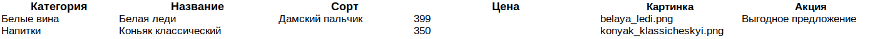

# Новое русское вино

Сайт магазина авторского вина "Новое русское вино".

## Запуск

- Скачайте код
- Установите зависимости

```
pip install -r requirements.txt
```
- Запустите сайт командой
 ```
python3 main.py -e Имя_файла_excel
 ```
или
 ```
python3 main.py
 ```
тогда в качестве тестового файла будет использован 
```
test.xlsx
```
Для развертывания своего сайта необходимо наличие excel файла вида:

или используйте готовый 
 ```
test.xlsx
 ```

- Перейдите на сайт по адресу [http://127.0.0.1:8000](http://127.0.0.1:8000).

## Цели проекта

Код написан в учебных целях — это урок в курсе по Python и веб-разработке на сайте [Devman](https://dvmn.org).
